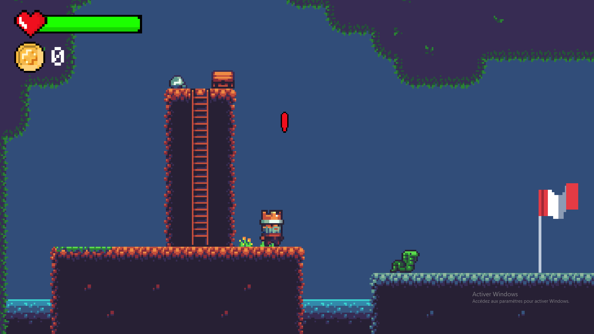

# 2D-Plateformer

> Un jeu de plateforme 2D simple développé avec Unity. Ce projet sert d'exercice pour moi même, afin de découvrir l'univers Unity



## 🚀 À propos du projet

Ce projet est un jeu de plateforme 2D classique. Le joueur contrôle un personnage qui peut se déplacer, sauter, grimper, tuer des enemies et bien sur mourir

## 🛠️ Technologies utilisées

* **Moteur de jeu :** Unity (Version 2022.3.46f1)
* **Langage :** C#
* **Assets graphiques :** Tilemap trouvé sur [OpenGameArt.org](https://opengameart.org/content/a-platformer-in-the-forest)

## 🔧 Installation et Lancement

**Option 1 : Lancer le projet dans l'éditeur**

1.  Assurez-vous d'avoir [Unity Hub](https://unity.com/download) et la version d'Unity 2022.3.46f1 installés.
2.  Clonez ce dépôt sur votre machine :
    ```bash
    git clone [https://github.com/julot424/2D-Plateformer.git](https://github.com/julot424/2D-Plateformer.git)
    ```
3.  Ouvrez Unity Hub, cliquez sur "Ouvrir" (ou "Add project"), et sélectionnez le dossier `2D-Plateformer` que vous venez de cloner.
4.  Ouvrez la scène principale (ex: `Assets/Scenes/Main.unity`) et appuyez sur Play.

**Option 2 : Jouer à une version "build"**

1.  Allez dans l'onglet [**Releases**](https://github.com/julot424/2D-Plateformer/releases) de ce dépôt.
2.  Téléchargez le fichier `.zip`.
3.  Dézippez le fichier et exécutez le jeu.

## ✨ Fonctionnalités

Voici une liste des fonctionnalités implémentées :

* Déplacement du joueur (gauche/droite)
* Saut (avec gestion du sol)
* Collecte de pièces
* Ennemis simples (patrouille)
* grimper des échelles
* Menu principale
